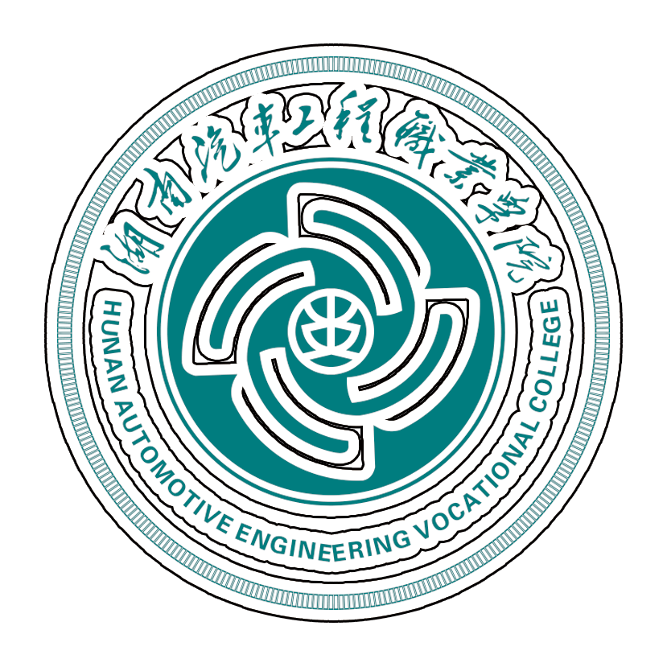

<div name="readme-top"></div>

<!-- Logo -->
<div align="center">
  
  <br/>

<h3><b>湖汽课表</b></h3>
</div>

<!-- 项目描述 -->

# 📖 湖汽课表 <a name="about-project"></a>

> 一个简单的项目，用于查询湖汽的课表


## 🛠 技术栈 <a name="built-with"></a>

### 技术栈 <a name="tech-stack"></a>

> 使用B/S 架构 后端使用Golang 前端使用React

<details>
  <summary>客户端</summary>
  <ul>
    <li><a href="https://reactjs.org/">React.js</a></li>
  </ul>
</details>

<details>
  <summary>服务端</summary>
  <ul>
    <li><a href="https://gin-gonic.com/">Gin</a></li>
  </ul>
</details>

<details>
<summary>课表分析</summary>
  <ul>
    <li><a href="https://www.python.org/">Python Pandas</a></li>
  </ul>
</details>

<!-- 特性 -->

<p align="right">(<a href="#readme-top">返回顶部</a>)</p>

<!-- 在线演示 -->

## 🚀 在线演示 <a name="live-demo"></a>


- [在线网站](https://c.d5v.cc)

<p align="right">(<a href="#readme-top">返回顶部</a>)</p>

<!-- 快速开始 -->

## 💻 快速开始 <a name="getting-started"></a>

### 后端
```sh
go get
go mod tidy
go run main.go
```

### 前端
```sh
yarn
yarn dev
yarn build
```

前端构建后`./dist`放到 `main.go` 同级目录

<p align="right">(<a href="#readme-top">返回顶部</a>)</p>

<!-- 贡献 -->

## 🤝 贡献 <a name="contributing"></a>

- 发现问题, 请先在 `issue` 中提问
- 如果你想接手本项目, 请先在 `issue` 中留言

<p align="right">(<a href="#readme-top">返回顶部</a>)</p>

<!-- 许可证 -->

## 📝 许可证 <a name="license"></a>

本项目基于MIT许可证开源，请遵守MIT许可证协议

<p align="right">(<a href="#readme-top">返回顶部</a>)</p>

